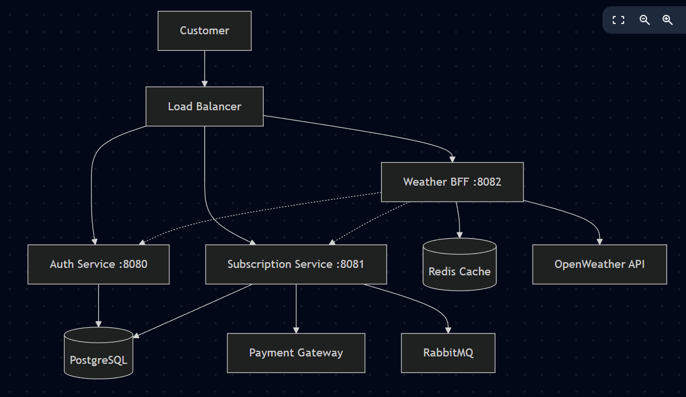

# Weather SaaS - Documentação Completa

## Visão Geral do Projeto

O Weather SaaS é uma plataforma de serviços meteorológicos baseada em microserviços, implementando arquitetura hexagonal e padrões de Domain-Driven Design (DDD). O sistema oferece dados meteorológicos através de um modelo de assinatura, com autenticação JWT e processamento de pagamentos.

### Exemplos de Payloads por Plano

#### 🆓 Usuário FREE - Payload Limitado
**Rate Limit**: 10 requisições por dia
**Endpoint**: `GET /v1/api/weather/{cityId}`

```json
{
 "coord": {
   "lon": -46.6333,
   "lat": -23.5505
 },
 "name": "São Paulo",
 "main": {
   "temp": 23.5,
   "humidity": 65
 }
}
```

#### 💎 Usuário PREMIUM - Payload Completo
**Rate Limit**: 10.000 requisições por dia
**Endpoint**: `GET /v1/api/weather/{cityId}`

```json
{
 "coord": {
   "lon": -46.6333,
   "lat": -23.5505
 },
 "weather": [
   {
     "id": 801,
     "main": "Clouds",
     "description": "few clouds",
     "icon": "02d"
   }
 ],
 "main": {
   "temp": 23.5,
   "feels_like": 25.2,
   "temp_min": 20.1,
   "temp_max": 26.8,
   "pressure": 1013,
   "humidity": 65
 },
 "visibility": 10000,
 "wind": {
   "speed": 3.6,
   "deg": 180
 },
 "sys": {
   "type": 1,
   "id": 8394,
   "country": "BR",
   "sunrise": 1642233600,
   "sunset": 1642280400
 },
 "name": "São Paulo"
}
```

### Diferenças Técnicas de Implementação

| Aspecto | FREE | PREMIUM |
|---------|------|---------|
| **Rate Limit Diário** | 10 requisições | 10.000 requisições |
| **Campos Retornados** | `coord`, `name`, `main.temp`, `main.humidity` | Todos os campos disponíveis |
| **Cache TTL** | 15 minutos (compartilhado) | 15 minutos (compartilhado) |
| **Dados Meteorológicos** | Básicos (temperatura e umidade) | Completos (vento, visibilidade, pressão, nascer/pôr do sol) |

## Arquitetura da Solução




## Como Executar o Projeto Weather SaaS 🚀

### 1. Gerar Chaves Pública e Privada para o Auth Service

No diretório auth-service, gere as chaves RSA:

```sh
openssl genrsa -out private.pem 2048
openssl rsa -in private.pem -pubout -out public.pem
```

Coloque os arquivos `private.pem` e `public.pem` em resources.

---

### 2. Definir a API Key do OpenWeatherMap no Docker Compose

No arquivo docker-compose.yml, adicione a variável de ambiente para o serviço weatherbff:

```yaml
services:
  weatherbff:
    environment:
      - OPENWEATHERMAP_APIKEY=your_api_key_here
    # ...outros parâmetros...
```

Substitua `your_api_key_here` pela sua chave da OpenWeatherMap.

---

### 3. Subir os Serviços com Docker Compose

No diretório raiz do projeto, execute:

```sh
docker-compose up -d --build
```

Isso irá construir as imagens e iniciar todos os serviços em segundo plano.

---

### 4. Pronto!

Acesse os serviços nas portas:

- **Auth Service:** http://localhost:8080
- **Weather Subscription Service:** http://localhost:8081
- **Weather BFF:** http://localhost:8082

---

**Observação:** Certifique-se de que Docker e Docker Compose estão instalados em sua máquina.

---


## Detalhamento dos Serviços

### 1. Auth Service (Porta 8080)

**Responsabilidade**: Gerenciamento de autenticação e autorização de usuários.

#### Funcionalidades Principais:
- Cadastro de usuários (`POST /auth/signup`)
- Autenticação de usuários (`POST /auth/signin`)
- Geração e validação de tokens JWT
- Fornecimento de chave pública para validação (`GET /auth/public-key`)

#### Tecnologias Utilizadas:
- **Spring Boot 3.5.5**
- **Spring Security** para autenticação
- **JWT (jsonwebtoken)** para tokens
- **Spring Data JPA** para persistência
- **PostgreSQL** como banco de dados
- **H2** para testes

#### Estrutura do Projeto:
```
auth-service/
├── controller/
│   ├── AuthController.java          # Endpoints de autenticação
│   ├── AuthPublicKeyController.java # Endpoint da chave pública
│   └── advice/                      # Tratamento global de exceções
├── dto/                            # Data Transfer Objects
├── entity/
│   └── User.java                   # Entidade de usuário
├── service/
│   └── AuthService.java            # Lógica de negócio
├── security/
│   └── SecurityConfig.java         # Configurações de segurança
└── utils/
   ├── JwtUtil.java                # Utilitários JWT
   └── KeyGenerator.java           # Geração de chaves
```

#### APIs Disponíveis:

**POST /auth/signup** - Cadastro de usuário
```json
{
   "username": "jhonatanedward",
   "email": "jhonatanedsp@gmail.com",
   "password": "1234"
}
```

**POST /auth/signin** - Login de usuário
```json
{
   "username": "jhonatanedward",
   "password": "1234"
}
```

**GET /auth/public-key** - Retorna chave pública para validação de tokens

### 2. Weather Subscription Service (Porta 8081)

**Responsabilidade**: Gerenciamento de assinaturas e processamento de pagamentos.

#### Funcionalidades Principais:
- Criação de assinaturas (`POST /v1/subscription`)
- Consulta de assinaturas (`GET /v1/subscription`)
- Processamento de pagamentos via webhook
- Integração com gateway de pagamento (Stripe/Mock)
- Publicação de eventos via RabbitMQ

#### Tecnologias Utilizadas:
- **Spring Boot 3.5.5**
- **Spring Data JPA** para persistência
- **Spring AMQP** para RabbitMQ
- **PostgreSQL** como banco de dados
- **Lombok** para redução de boilerplate
- **Jackson** para serialização JSON

#### Estrutura Hexagonal:

**Domain Layer:**
```
domain/
└── model/
   ├── Subscription.java    # Entidade principal
   ├── Plan.java           # Enum de planos
   └── Status.java         # Enum de status
```

**Application Layer:**
```
application/
├── ports/
│   ├── in/                 # Portas de entrada
│   │   ├── CreateSubscriptionUseCase.java
│   │   ├── FindSubscriptionUseCase.java
│   │   └── ProcessPaymentUseCase.java
│   └── out/                # Portas de saída
│       ├── SubscriptionRepositoryPort.java
│       ├── PaymentGatewayPort.java
│       └── MessageQueuePort.java
└── services/
   ├── SubscriptionService.java
   └── ProcessPaymentService.java
```

**Infrastructure Layer:**
```
infrastructure/
└── adapter/
   ├── controller/         # Adaptadores de entrada
   ├── repository/         # Adaptadores de persistência
   ├── gateway/           # Adaptadores de gateway
   └── queue/             # Adaptadores de mensageria
```

#### APIs Disponíveis:

**POST /v1/subscription** - Criar assinatura
```json
{
   "user_id": "12345",
   "email": "teste@exemplo.com"
}
```

**GET /v1/subscription** - Consultar assinatura
```json
{
   "status": "success",
   "message": "Ok",
   "data": {
       "id": "ea12c854-0050-462e-9c22-8d240487e74b",
       "user_id": "12345",
       "plan_type": "FREE",
       "external_subscription_id": "sub_7456762787906756008",
       "checkout_url": "https://mock-checkout.com/session?id=sub_7456762787906756008",
       "status": "PENDING",
       "free_plan": true
   }
}
```

### 3. Weather BFF (Backend for Frontend) (Porta 8082)

**Responsabilidade**: Agregação de serviços e fornecimento de dados meteorológicos.

#### Funcionalidades Principais:
- Agregação de dados de múltiplos serviços
- Cache de dados meteorológicos com Redis
- Validação de tokens JWT
- Controle de acesso baseado em assinatura
- Retry automático para chamadas externas

#### Tecnologias Utilizadas:
- **Spring Boot 3.3.1**
- **Spring Security** para autenticação
- **Spring Data Redis** para cache
- **Spring AMQP** para mensageria
- **Spring Retry** para retry automático
- **MapStruct** para mapeamento de objetos
- **Lombok** para redução de boilerplate

#### Estrutura do Projeto:
```
weatherbff/
├── adapters/
│   └── controllers/
│       ├── WeatherController.java      # Endpoints meteorológicos
│       └── SubscriptionController.java # Proxy para subscription
├── domain/
│   ├── model/                         # Modelos de domínio
│   └── port/                          # Portas do domínio
└── infrastructure/                    # Adaptadores de infraestrutura
```

#### APIs Disponíveis:

**GET /v1/api/weather/{cityId}** - Obter dados meteorológicos
- Requer autenticação JWT
- Valida assinatura do usuário
- Retorna dados em cache quando disponível
- Resposta varia conforme plano do usuário (ver seção "Diferenças entre Planos")

**POST /v1/api/subscription** - Criar assinatura (proxy)

**GET /v1/api/subscription** - Consultar assinatura (proxy)

## Diferenças entre Planos Free e Premium

### Comparativo de Funcionalidades

| Funcionalidade | Plano Free | Plano Premium |
|---|---|---|
| **Requisições por dia** | 100 | Ilimitadas |
| **Dados históricos** | Últimos 7 dias | Últimos 365 dias |
| **Previsão estendida** | 3 dias | 15 dias |
| **Dados detalhados** | Básicos | Completos |
| **Frequência de atualização** | A cada 3 horas | A cada hora |
| **Suporte técnico** | Comunidade | Prioritário |
| **API Rate Limit** | 10 req/min | 1000 req/min |

### Estrutura de Resposta da API Weather

#### Usuário Free - Resposta Limitada
```json
{
    "coord": {
        "lon": -46.6228,
        "lat": -23.6861
    },
    "main": {
        "temp": 287.89,
        "feels_like": 0.0,
        "temp_min": 0.0,
        "temp_max": 0.0,
        "pressure": 0,
        "humidity": 96
    },
    "visibility": 0,
    "name": "Diadema"
}
```

#### Usuário Premium - Resposta Completa
```json
{
    "coord": {
        "lon": -46.6228,
        "lat": -23.6861
    },
    "weather": [
        {
            "id": 802,
            "main": "Clouds",
            "description": "scattered clouds",
            "icon": "03n"
        }
    ],
    "main": {
        "temp": 287.89,
        "feels_like": 287.93,
        "temp_min": 0.0,
        "temp_max": 0.0,
        "pressure": 1020,
        "humidity": 96
    },
    "wind": {
        "speed": 5.66,
        "deg": 130
    },
    "visibility": 10000,
    "name": "Diadema"
}
```

### Controle de Acesso por Plano

O Weather BFF implementa controle de acesso baseado no tipo de plano:

```java
@Component
public class PlanBasedResponseFilter {
  
   public WeatherResponse filterResponse(WeatherResponse fullResponse, PlanType planType) {
       if (planType == PlanType.FREE) {
           return WeatherResponse.builder()
               .status(fullResponse.getStatus())
               .planType("FREE")
               .data(filterFreeData(fullResponse.getData()))
               .build();
       }
       return fullResponse;
   }
  
   private WeatherData filterFreeData(WeatherData data) {
       return WeatherData.builder()
           .cityId(data.getCityId())
           .cityName(data.getCityName())
           .current(filterCurrentData(data.getCurrent()))
           .forecast(limitForecast(data.getDailyForecast(), 3))
           .limitations(buildLimitations())
           .build();
   }
}
```

### Rate Limiting por Plano

```yaml
# application.yml - Weather BFF
rate-limiting:
 free:
   requests-per-minute: 10
   requests-per-day: 100
 premium:
   requests-per-minute: 1000
   requests-per-day: -1  # unlimited
```

## Integração Entre Serviços

### Fluxo de Autenticação
1. Cliente faz login no **Auth Service**
2. **Auth Service** retorna JWT token
3. Cliente usa token para acessar **Weather BFF**
4. **Weather BFF** valida token usando chave pública do **Auth Service**

### Fluxo de Assinatura
1. **Weather BFF** encaminha solicitação para **Subscription Service**
2. **Subscription Service** cria assinatura com status PENDING
3. **Subscription Service** integra com gateway de pagamento
4. Webhook de pagamento ativa assinatura
5. **Subscription Service** publica evento no RabbitMQ
6. **Weather BFF** consome evento e atualiza cache

### Fluxo de Dados Meteorológicos
1. Cliente autenticado solicita dados via **Weather BFF**
2. **Weather BFF** verifica assinatura no **Subscription Service**
3. **Weather BFF** consulta cache Redis
4. Se não houver cache, busca na API externa
5. Dados são cacheados e retornados

## Infraestrutura e Deployment

### Docker Compose
O projeto utiliza Docker Compose para orquestração dos serviços:

```yaml
services:
 auth-service:        # Porta 8080
 weather-subscription: # Porta 8081
 weather-bff:         # Porta 8082 (comentado)
 rabbitmq:           # Portas 5672, 15672
 db:                 # PostgreSQL - Porta 5432
 redis:              # Porta 6379
```

### Rede e Comunicação
- **Rede Docker**: `weather-network`
- **Banco de Dados**: PostgreSQL compartilhado
- **Cache**: Redis para Weather BFF
- **Mensageria**: RabbitMQ para eventos assíncronos

### Volumes Persistentes
- `db-data`: Dados do PostgreSQL
- `rabbitmq_data`: Dados do RabbitMQ
- `redis-data`: Dados do Redis

## Padrões Arquiteturais Implementados

### 1. Arquitetura Hexagonal (Ports & Adapters)
- **Implementada no Subscription Service**
- Separação clara entre domínio, aplicação e infraestrutura
- Portas definem contratos de entrada e saída
- Adaptadores implementam integrações específicas

### 2. Domain-Driven Design (DDD)
- Modelos de domínio ricos (`Subscription`, `Plan`, `Status`)
- Use Cases bem definidos
- Separação de responsabilidades por contexto

### 3. Backend for Frontend (BFF)
- **Weather BFF** agrega múltiplos serviços
- Otimização para necessidades específicas do frontend
- Cache e retr